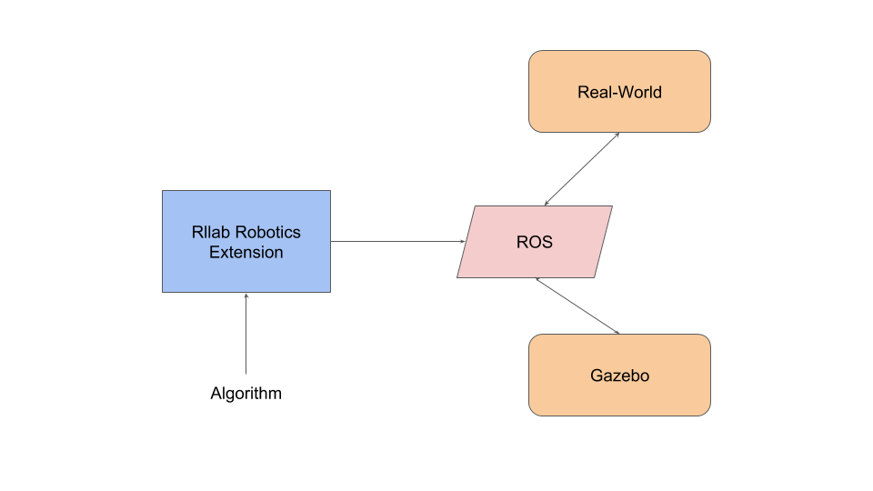

# Rllab Robotics Extension called rllab-ros
## Reinforcement Learning with ROS and Gazebo
The Rllab is a toolkit for reinforcement learning which 
has recently gained popularity in the robot learning community.
The work presented here builds a general ros environment interfaces 
which focuses on combining robot learning in simulation and real world. 

The work is developed by [Hejia Zhang](http://www.hejiazhang.org).
## Gazebo Simulator
[Gazebo Simulator](http://gazebosim.org/) is a 3D modeling and rendering tool where
you can use the same ros operation to control robot with in real world.
rllab.contrib.ros's environments take a different approach. 
## Architecture
The Architecture consists of three main software blocks: 
Rllab Robotics Extension, ROS and Gazebo (Figure 1). Environments 
developed in Rllab Robotics Extension interact with the ROS which is
 the connection between the Algorithm and Gazebo/Real-World. 
  

Fig. 1: Simpified software architecture used in Rllab for robotics.
## Examples
- [Sawyer Robot](envs/sawyer/README.md)
## Future directions
The presented toolkit could be further improved 
in the following directions:
- Speed up simulation for robots. Currently, the simulation is set
 to maximum 4x(real) speed.
- Provide additional tools for comparing algorithms.
- Provide additional tool for Sim-to-Real transfer learning.
## References
- Yan Duan, Xi Chen, Rein Houthooft, John Schulman, Pieter Abbeel. 
"Benchmarking Deep Reinforcement Learning for Continuous Control". 
Proceedings of the 33rd International Conference on Machine Learning 
(ICML), 2016.

